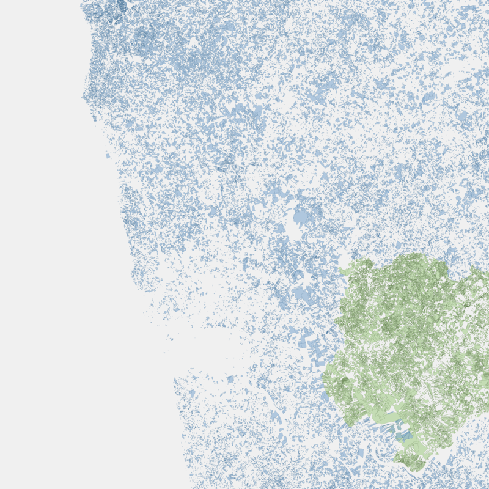

# Portugal Cadastral Parcels Scraper

Downloads all cadastral parcels from Portugal (4.9M+ parcels) and outputs a single normalized GeoJSON file.

<p align="center">
  
  
  <br>
  <em>Green: INSPIRE cadastral parcels | Blue: RGG registered parcels</em>
</p>

## Discovery

Endpoints were discovered by inspecting network requests on the BUPi (Balcao Unico do Predio) map:
https://experience.arcgis.com/experience/4f7ae3949aae46d59d119e4b3094f21f

The map loads parcel data from two sources:
- WMS tiles from DGT GeoServer for base cadastral layer
- ArcGIS FeatureServer queries for registered parcels overlay

By checking the GeoServer capabilities (`?service=WFS&request=GetCapabilities`), we found WFS endpoints that serve the same data as vector features instead of raster tiles.

## Data Sources

### 1. INSPIRE Cadastral Parcels (WFS)

```
https://snicws.dgterritorio.gov.pt/geoserver/wfs
```

- Layer: `inspire:cadastralparcel`
- Format: GeoJSON via `outputFormat=application/json`
- CRS: EPSG:3763 (Portuguese TM06)
- Pagination: `startIndex` + `count` parameters
- Coverage: All of Portugal (~1.8M parcels)

Example request:
```
GET /geoserver/wfs?service=WFS&version=2.0.0&request=GetFeature
    &typeName=inspire:cadastralparcel
    &outputFormat=application/json
    &startIndex=0
    &count=50000
```

### 2. RGG Registered Parcels (ArcGIS REST)

```
https://geo.bupi.gov.pt/gisbupi/rest/services/opendata/RGG_DadosGovPT/MapServer/0/query
```

- Format: GeoJSON via `f=geojson`
- CRS: EPSG:4326 via `outSR=4326`
- Pagination: `resultOffset` + `resultRecordCount` parameters
- Coverage: Northern Portugal registered properties (~3.1M parcels)

Example request:
```
GET /MapServer/0/query?where=1=1
    &outFields=*
    &returnGeometry=true
    &outSR=4326
    &resultOffset=0
    &resultRecordCount=2000
    &f=geojson
```

## How It Works

1. Downloads INSPIRE parcels in batches of 50,000 via WFS
2. Downloads RGG parcels in batches of 2,000 via ArcGIS REST API
3. Reprojects INSPIRE from EPSG:3763 to EPSG:4326
4. Normalizes both datasets to common schema
5. Merges into single GeoJSON file
6. Cleans up temp files

## Output Schema

| Field | Description |
|-------|-------------|
| id | Unique identifier |
| reference | National cadastral reference (INSPIRE only) |
| area_m2 | Area in square meters |
| source | `inspire` or `rgg` |
| geometry | Polygon in EPSG:4326 |

## Installation

```bash
uv sync
```

## Usage

```bash
uv run portugal-parcels
```

Output: `output/portugal_parcels.geojson` (~5 GB)

